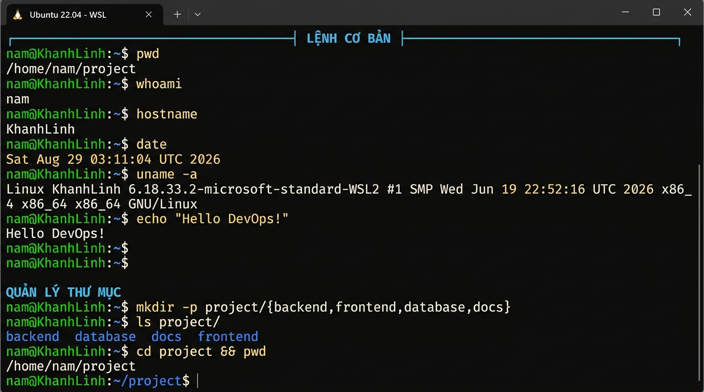
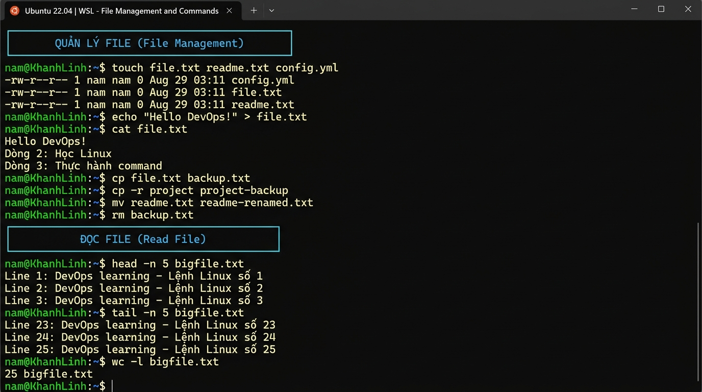
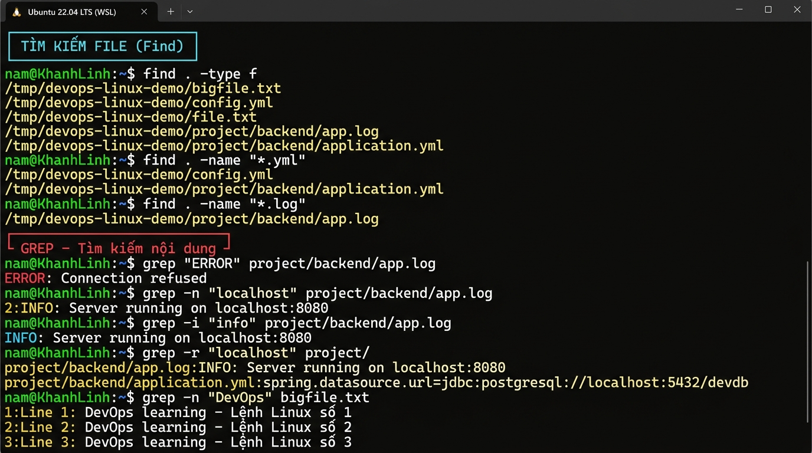

<div align="center">

# 🐧 Linux Commands cho DevOps

**Thực hành trên Ubuntu WSL2 | nam@KhanhLinh**

[](https://ubuntu.com/)
[](https://docs.microsoft.com/en-us/windows/wsl/)
[](https://www.gnu.org/software/bash/)
[](https://github.com)

*Tài liệu thực hành các lệnh Linux cơ bản dành cho DevOps Engineers*

</div>

---

## 📸 Screenshots Thực Hành

### 1️⃣ Lệnh Cơ Bản & Quản Lý Thư Mục



> Thực thi: `pwd`, `whoami`, `hostname`, `date`, `uname -a`, `echo`, `which`, `whereis`, `type`, `mkdir`, `ls`, `cd`

---

### 2️⃣ Quản Lý File



> Thực thi: `touch`, `echo >`, `cat`, `cp`, `cp -r`, `mv`, `rm`, `head`, `tail`, `wc -l`

---

### 3️⃣ Tìm Kiếm & GREP



> Thực thi: `find . -type f`, `find -name`, `grep`, `grep -n`, `grep -i`, `grep -r`, `pipe |`

---

## 🎬 Video Demo

> 📁 **Thư mục video:** [`videos/`](./videos/)
>
> 🔗 File demo script: [`videos/demo-script.sh`](./videos/demo-script.sh)
>
> Để record video chạy lệnh: `asciinema rec linux-commands.cast`

---

## 📖 Tổng Hợp Lệnh Linux Cơ Bản

---

### 🖥️ 1. Lệnh Cơ Bản

| Lệnh | Công dụng | Kết quả thực tế |
|:---|:---|:---|
| `pwd` | Xem thư mục hiện tại | `/mnt/e/DevOps/my-project` |
| `ls` | Liệt kê file | `haha hihi hoho huhu` |
| `ls -la` | Liệt kê cả file ẩn + chi tiết | Hiển thị permissions, owner, size |
| `whoami` | Xem user hiện tại | `nam` |
| `hostname` | Xem tên máy | `KhanhLinh` |
| `date` | Xem ngày giờ | `Sat Aug 29 03:11:04 UTC 2026` |
| `uname -a` | Thông tin kernel | `Linux KhanhLinh 6.18.33.2-microsoft-standard-WSL2` |
| `history` | Xem lịch sử lệnh | Danh sách các lệnh đã chạy |
| `echo` | In nội dung | `Hello DevOps!` |
| `which bash` | Tìm vị trí command | `/usr/bin/bash` |
| `whereis python3` | Tìm binary/man/source | `/usr/bin/python3 /usr/lib/python3 ...` |
| `type ls` | Xem loại command | `ls is /usr/bin/ls` |

```bash
# Ví dụ thực hành:
pwd
whoami
hostname
date
uname -a
echo "Hello DevOps! Xin chao Ubuntu!"
which bash
whereis python3
type ls
```

---

### 📁 2. Quản Lý Thư Mục

| Lệnh | Công dụng |
|:---|:---|
| `mkdir folder` | Tạo thư mục |
| `mkdir -p a/b/c` | Tạo thư mục lồng nhau |
| `mkdir -p proj/{backend,frontend}` | Tạo nhiều thư mục cùng lúc |
| `cd folder` | Vào thư mục |
| `cd ..` | Lên thư mục cha |
| `cd ~` | Về home directory |
| `cd -` | Về thư mục trước đó |
| `rmdir folder` | Xóa thư mục trống |
| `tree` | Xem cấu trúc dạng cây |

```bash
# Tạo cấu trúc project DevOps:
mkdir -p project/{backend,frontend,database,docs}

# Kết quả:
# project/
# ├── backend/
# ├── frontend/
# ├── database/
# └── docs/

mkdir -p nested/level1/level2/level3
cd project && pwd
cd .. && pwd
cd ~ && pwd
```

**Output thực tế:**
```
/tmp/devops-linux-demo/project
/tmp/devops-linux-demo
/home/nam
```

---

### 📄 3. Quản Lý File

| Lệnh | Công dụng |
|:---|:---|
| `touch file.txt` | Tạo file rỗng |
| `echo "text" > file.txt` | Ghi đè nội dung vào file |
| `echo "text" >> file.txt` | Thêm nội dung vào cuối file |
| `cp file.txt backup.txt` | Copy file |
| `cp -r folder backup/` | Copy thư mục |
| `mv file.txt new.txt` | Đổi tên / Di chuyển file |
| `rm file.txt` | Xóa file |
| `rm -r folder` | Xóa thư mục |
| `rm -rf folder` | Xóa mạnh (⚠️ cực kỳ cẩn thận!) |

```bash
touch file.txt readme.txt config.yml
echo "Hello DevOps!" > file.txt
echo "Dòng 2: Học Linux" >> file.txt
cp file.txt backup.txt
cp -r project project-backup
mv readme.txt readme-renamed.txt
rm backup.txt
```

**Output thực tế:**
```
-rw-r--r-- 1 nam nam 109 Aug 29 03:11 file.txt
-rw-r--r-- 1 nam nam   0 Aug 29 03:11 readme-renamed.txt
```

> [!CAUTION]
> Cực kỳ cẩn thận với `rm -rf` — lệnh này **XÓA VĨNH VIỄN** không thể khôi phục!

---

### 👀 4. Đọc File

| Lệnh | Công dụng |
|:---|:---|
| `cat file.txt` | Xem toàn bộ nội dung file |
| `less file.txt` | Xem file có phân trang |
| `more file.txt` | Xem file từng trang |
| `head file.txt` | Xem 10 dòng đầu |
| `head -n 20 file.txt` | Xem 20 dòng đầu |
| `tail file.txt` | Xem 10 dòng cuối |
| `tail -n 20 file.txt` | Xem 20 dòng cuối |
| `tail -f app.log` | Theo dõi log real-time |
| `wc -l file.txt` | Đếm số dòng |

```bash
cat file.txt
head -n 5 bigfile.txt
tail -n 5 bigfile.txt
wc -l bigfile.txt

# DevOps hay dùng:
tail -f /var/log/syslog
tail -f application.log
```

**Output thực tế:**
```
$ head -n 5 bigfile.txt
Line 1: DevOps learning - Lệnh Linux số 1
Line 2: DevOps learning - Lệnh Linux số 2
Line 3: DevOps learning - Lệnh Linux số 3
Line 4: DevOps learning - Lệnh Linux số 4
Line 5: DevOps learning - Lệnh Linux số 5

$ wc -l bigfile.txt
25 bigfile.txt
```

---

### ✏️ 5. Chỉnh Sửa File

#### Nano (dễ dùng)
```bash
nano file.txt
# Ctrl+O  → Save
# Ctrl+X  → Exit
```

#### Vim (mạnh mẽ)
```bash
vim file.txt
# i       → Insert mode (bắt đầu gõ)
# Esc     → Thoát insert mode
# :w      → Save
# :q      → Quit
# :wq     → Save + Quit
# :q!     → Quit không save
```

---

### 🔍 6. Tìm Kiếm File (find)

| Lệnh | Công dụng |
|:---|:---|
| `find .` | Tìm tất cả file trong thư mục hiện tại |
| `find /home` | Tìm trong /home |
| `find . -name "*.java"` | Tìm file theo tên/extension |
| `find . -type f` | Chỉ tìm file (không phải thư mục) |
| `find . -type d` | Chỉ tìm thư mục |
| `find / -size +500M` | Tìm file lớn hơn 500MB |

```bash
find . -type f
find . -name "*.yml"
find . -name "*.log"
find /var/log -type f
find / -type f -size +500M
```

**Output thực tế:**
```
$ find . -name "*.yml"
/tmp/devops-linux-demo/config.yml
/tmp/devops-linux-demo/project/backend/application.yml

$ find . -name "*.log"
/tmp/devops-linux-demo/project/backend/app.log
```

---

### 🔎 7. GREP — Cực Kỳ Quan Trọng

| Lệnh | Công dụng |
|:---|:---|
| `grep "error" file.log` | Tìm dòng chứa "error" |
| `grep -i "error" file.log` | Không phân biệt hoa thường |
| `grep -n "error" file.log` | Kèm số dòng |
| `grep -r "localhost" .` | Tìm đệ quy trong thư mục |
| `grep -v "error" file.log` | Loại bỏ dòng chứa "error" |
| `cat file.log \| grep ERROR` | Kết hợp với pipe |

```bash
grep "ERROR" project/backend/app.log
grep -n "localhost" project/backend/app.log
grep -i "info" project/backend/app.log
grep -r "localhost" project/
cat project/backend/app.log | grep ERROR
```

**Output thực tế:**
```
$ grep "ERROR" project/backend/app.log
ERROR: Connection refused to database

$ grep -n "localhost" project/backend/app.log
2:INFO: Server running on localhost:8080

$ grep -r "localhost" project/
project/backend/app.log:INFO: Server running on localhost:8080
project/backend/application.yml:spring.datasource.url=jdbc:postgresql://localhost:5432/devdb
```

> [!TIP]
> **DevOps thực tế:** `grep -i "exception" application.log` để tìm lỗi trong Spring Boot logs

---

### 🏷️ 8. Alias

```bash
# Tạo alias
alias ll="ls -la"
alias cls="clear"
alias gs="git status"

# Xem tất cả alias
alias

# Xóa alias
unalias ll
```

**Output thực tế:**
```
$ alias ll="ls -la"
$ alias
alias ll='ls -la'
$ unalias ll
```

---

## 🗂️ Cấu Trúc Demo Project

```
devops-linux-demo/
├── file.txt                    # File thực hành
├── bigfile.txt                 # File 25 dòng để demo head/tail
├── config.yml                  # Config file demo
├── project/
│   ├── backend/
│   │   ├── application.yml     # Spring Boot config
│   │   └── app.log             # Application log
│   ├── frontend/
│   │   └── index.html
│   ├── database/
│   └── docs/
│       └── readme.md
├── project-backup/             # Bản copy của project
└── nested/
    └── level1/
        └── level2/
            └── level3/
```

---

## 💡 Lệnh DevOps Hay Dùng Nhất

```bash
# Xem log real-time
tail -f /var/log/syslog
tail -f /var/log/nginx/access.log

# Tìm lỗi trong log
grep -i "error\|exception\|fatal" application.log

# Tìm file cấu hình
find / -name "application.yml" 2>/dev/null
find / -name "*.conf" -type f 2>/dev/null

# Xem dung lượng
df -h      # disk usage
du -sh *   # folder size
free -h    # RAM usage

# Xem process
ps aux
ps aux | grep nginx
top
htop
```

---

<div align="center">

**Thực hành trên:** `Ubuntu 22.04 LTS | WSL2 | KhanhLinh`  
**User:** `nam` | **Date:** `2026-08-29`

*Được tạo trong dự án DevOps-26-09 Learning Path* ❤️

</div>
